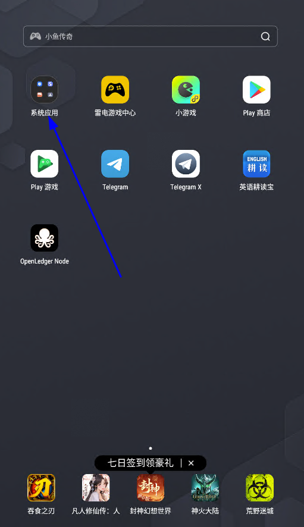
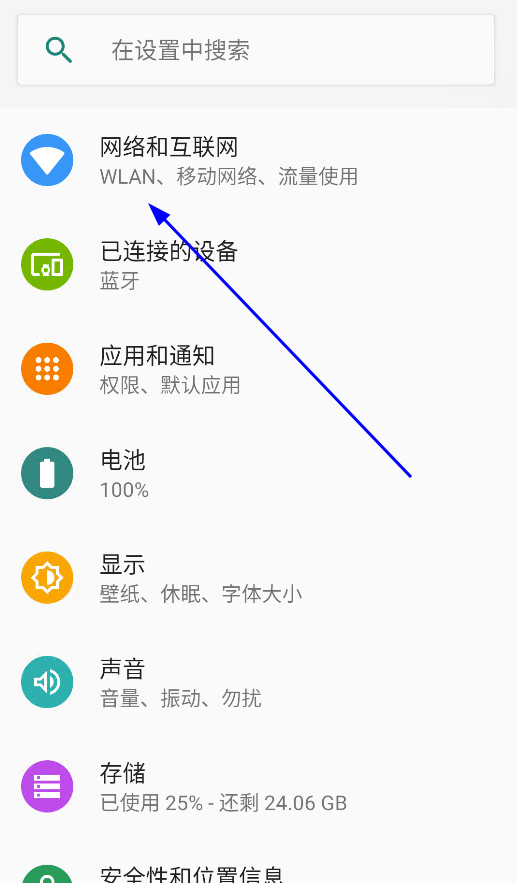
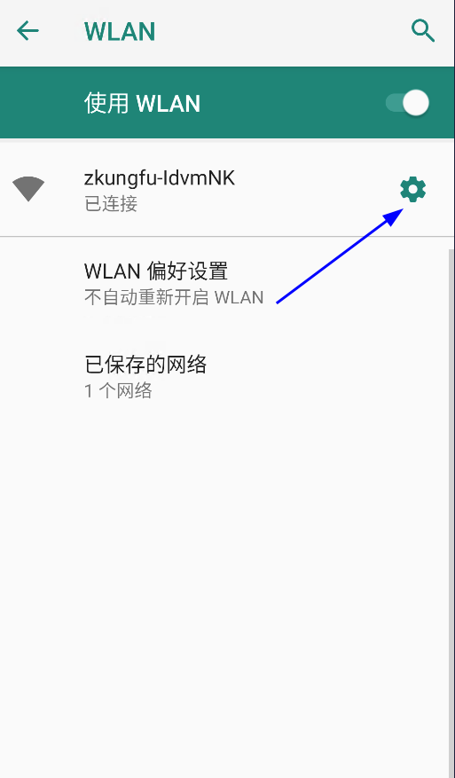
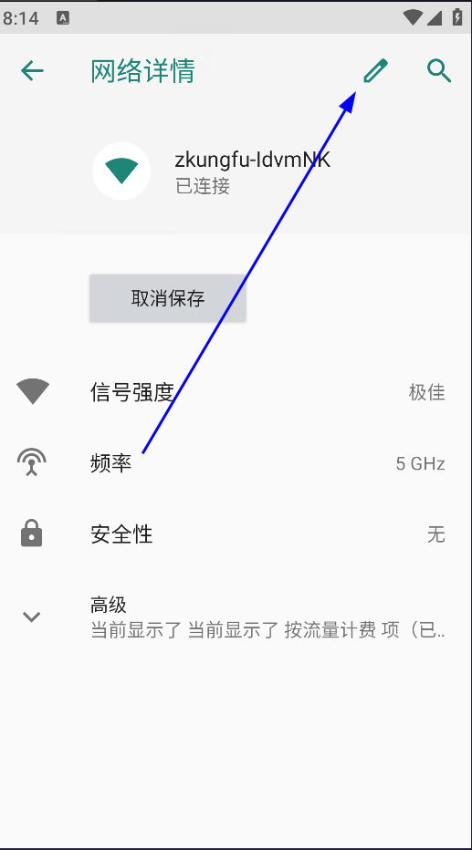
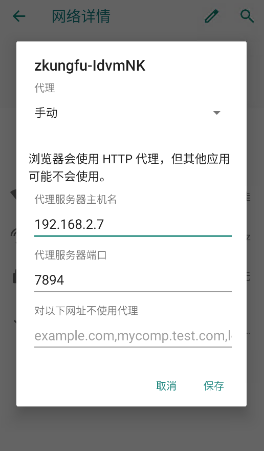
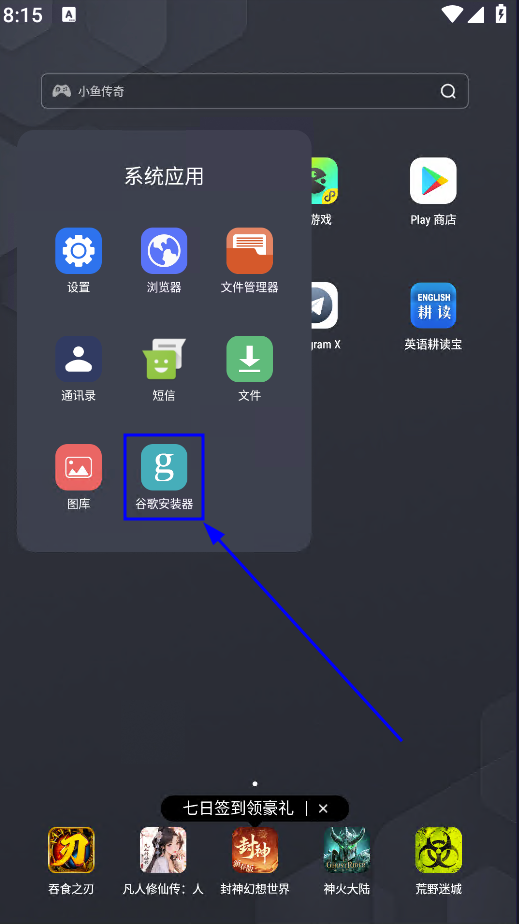
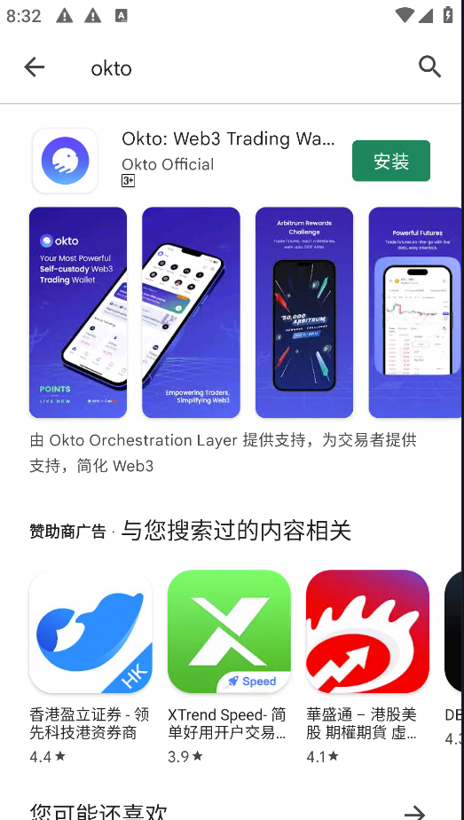
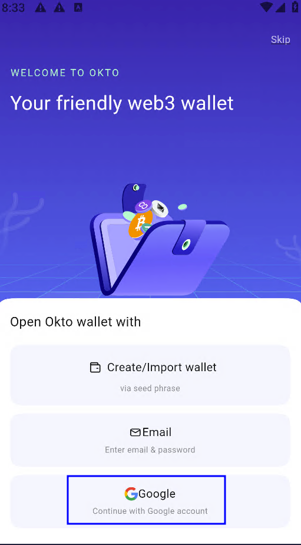
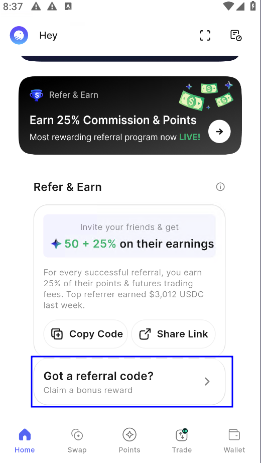

@hyperliquid 生态链下的抽象钱包 @okto_web3 明牌空投
 作为本轮最牛逼的空投大毛，HYPE从来都是典型的一鱼多吃，今天说个很少人知道的空投
1、直接 $HYPE 代币奖励
2、 $OKTO 积分空投
3、Hyperliquid 生态奖励
4、不定期的特别代币空投

@okto_web3是什么项目？

印度加密货币交易所 @CoinDCX
（Coinbase投资2.3亿美金，估值11亿）于 2024 年5月推出的链抽象钱包，是唯一集成了@hyperliquid 的加密钱包，已明确发币

1、钱包下载：https://play.google.com/store/apps/details?id=com.coindcx.okto
2、导入/新建钱包
3、输入邀请码，领取积分 got a referral code?这里输入ZIVacF，领50积分
4、点右下角Trade ，直接进入 @hyperliquid 交易界面

# 图文教程
## 需要准备的工具：
### 1、电脑或者手机，需要爬墙或者有代理池。
### 2、需要gmail

## 1、安装雷电模拟器：https://www.ldmnq.com/

## 2、设置你的模拟器爬墙
打开设置

打开wifi

设置代理1

设置代理2

输入邀请码赚分

## 2、安装谷歌市场

## 3、下载okto钱包
### 1、钱包下载：https://play.google.com/store/apps/details?id=com.coindcx.okto
使用浏览器打开url或者使用play商店搜索okto钱包下载按照

### 2、选择gmail

### 3、输入你的邀请码就会得到50分

### 3、其他等待破解。。。。你懂得！

